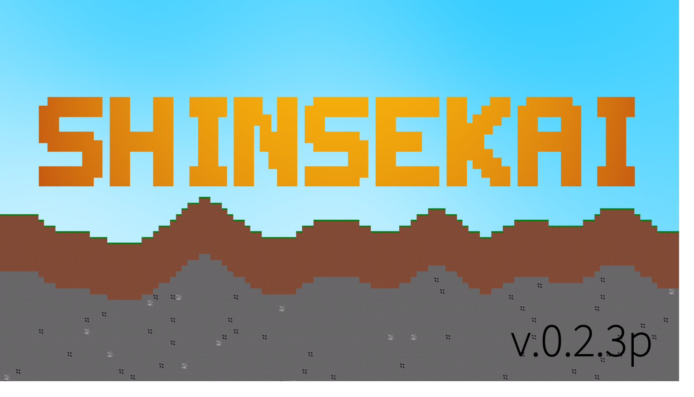
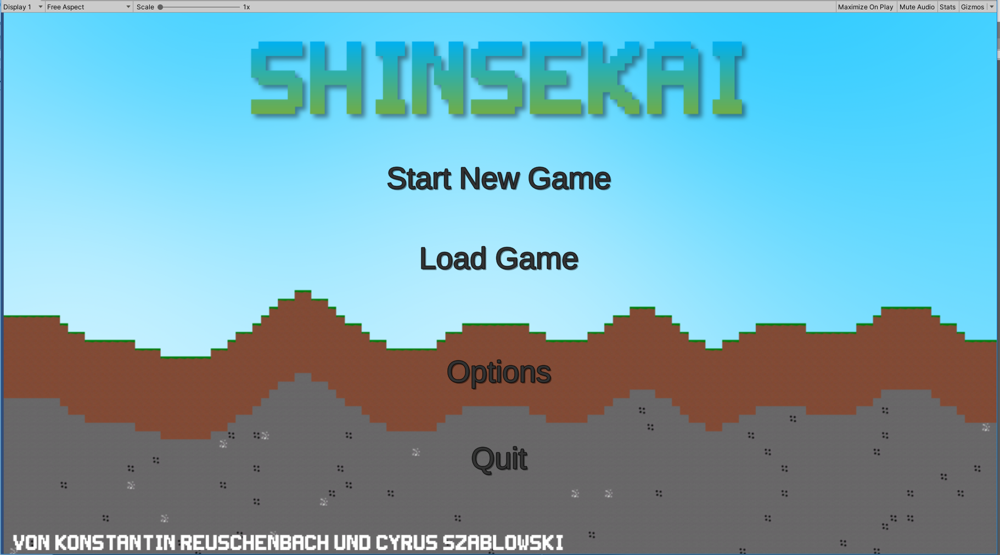
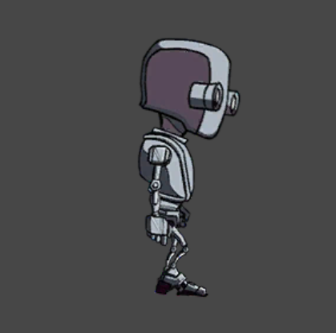
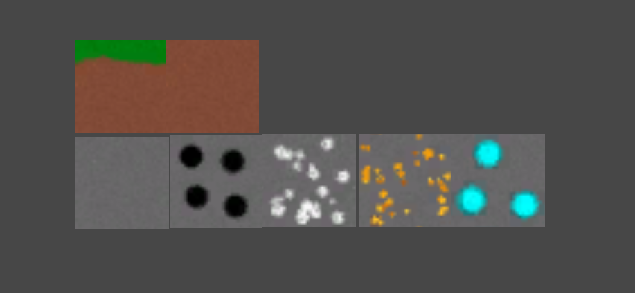
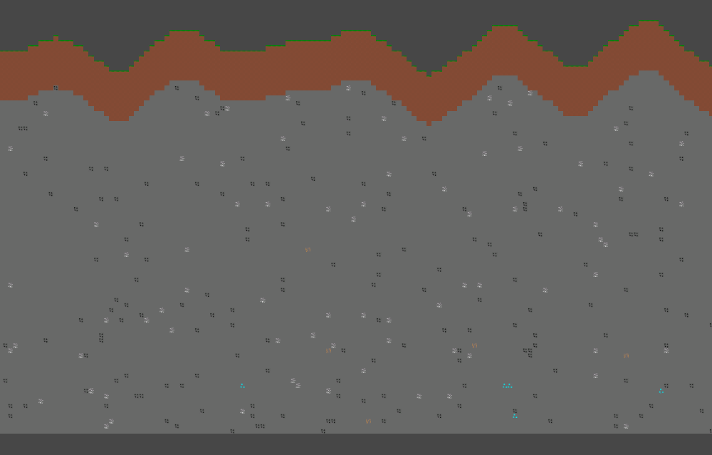
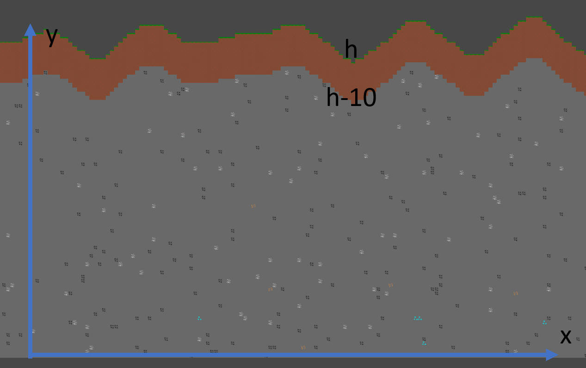

# 2D-Spiel: Shinsekai (Unity,C#)

Shinskai ist ein Indie 2D-Spielprojekt erstellt von Konstantin Reuschenbach und Cyrus Szablowski. Das Projekt befindet sich in einem Zustand, sodass man von keiner Vollversion sprechen kann. Die neueste Version momentan ist Shinsekai v.0.2.3p. Hierbei handelt es sich um ein Open World 2d Survival "Game". 



## Startguide:
Momentan gibt es keine fertige Vollversion, deswegen lässt sich das Projekt nur über Unity öffnen, die Assets lassen sich hier downloaden:
https://drive.google.com/file/d/1ZAYIKvQix2woFSQYenWP4rokmbVD1fj_/view?usp=sharing

Hier geht es zum Arbeitslog:
https://github.com/LordKonstantin007/Arbeits-Log-2dgame


### 1. Spielszenen (Hauptmenü, Spiel)
### 2. Spieler Bewegung und Spielcharakter
### 3. Camera Movement 
### 4. World Generation:
### 5. Fazit
### 6. Quellen


## Spielscenen (Hauptmenü, Spiel)
Es gibt momentan zwei Scenen, eine Welt wird nach betätigen des "NEW WORLD Knopfs" generiert, dabei wird von der Hauptmenüscene in die Game Scene gewechselt:

```
using System.Collections;
using System.Collections.Generic;
using UnityEngine;
using UnityEngine.SceneManagement;

public class MainMenu : MonoBehaviour
{
    public void PlayGame()
    {
        SceneManager.LoadScene(1);
    }

    public void QuitGame()
    {
        Application.Quit();
    }
}

```
Es gibt zwei Scenen, das Hauptmenü und das Spiel besitzen jeweils eine Index Nummer welche über den Scene Manager geladen werden können. Die Scenen lassen sich in den Build Settings verwalten. Die Funktion PlayGame() wird aufegrufen, wenn man auf den Play New Game Button klickt wird. Und wenn man auf den Quit button klickt wird das Spiel geschlossen. 
## Spieler Bewegung und Spielcharakter
Dieser Part funktioniert bisher nicht sehr gut, wir haben relativ viele verschiedene (um die 10) Character Controller Script generell ausprobiert, bisher gab es kein gutes Ergebnis, das ist auch kein finaler Script aber es ist nun so wie es ist. Das Charakter Model im Spiel ist momentan ein Dummy. 




https://www.youtube.com/watch?v=905DFJR241g

```
using UnityEngine;
using System.Collections;

[RequireComponent(typeof(Rigidbody2D))]
public class Character : MonoBehaviour
{

    public float speed;
    public KeyCode jumpKey = KeyCode.Space;
    public Sprite[] walkSprites;
    public Sprite idleSprite;
    public float jumpSpeed;


    bool isWalking;
    bool isGrounded;

    void Update()
    {

        Rigidbody2D r = GetComponent<Rigidbody2D>();
        r.velocity = new Vector2(Input.GetAxis("Horizontal") * speed, r.velocity.y);
        if (r.velocity.magnitude > 0.1f)
        {
            if (!isWalking)
            {
                StartCoroutine(Walk());
            }
        }

      
        if (isGrounded)
        {
            if (Input.GetKeyDown(jumpKey))
            {
                r.velocity = new Vector2(r.velocity.x, jumpSpeed);
            }
        }

        if (!isWalking)
        {
            GetComponent<SpriteRenderer>().sprite = idleSprite;
        }


    }

    IEnumerator Walk()
    {
        isWalking = true;
        GetComponent<SpriteRenderer>().sprite = walkSprites[0];
        yield return new WaitForSeconds(0.25f);
        GetComponent<SpriteRenderer>().sprite = walkSprites[1];
        yield return new WaitForSeconds(0.25f);
        isWalking = false;


    }
}

```
## Camera Movement 
Wenn die Game Scene geladen wird, folgt die Kamera, dem Spieler auf der x- und y-Achse. Momentan ist die Kamera zwar noch verbuggt, aber die Kamera folgt nun perfekt dem Spieler.

```
using System.Collections;
using System.Collections.Generic;
using UnityEngine;

public class CameraFollow2 : MonoBehaviour
{
    private Transform playerTransform;

    void Start()
    {
        playerTransform = GameObject.FindGameObjectWithTag("Player").transform;
    }

   
    void LateUpdate()
    {
        Vector3 temp = transform.position;

        temp.x = playerTransform.position.x;
        temp.y = playerTransform.position.y;

        transform.position = temp;
    }
}
```
Die Position der Kamera wird in der Variable temp gespeichert, darauf werden die X-Position und die Y-Position des Spielers, 
auf die Kamera übertragen.
## World Generation:
Die Welt wird über zwei Scripte hauptächlich generiert. Generate.Chunk.cs und Generate.Chunks.cs. 




### Generate.Chunks
Dieses Script ist für die Erstellung verschiedener Chunks verantwortlich, dazu wird das GenerateChunk Scipt geladen als Grundlage/Anleitung unter welchen Regeln die Chunks generiert werden sollen. Dazu haben wir ein Chunk-Prefab eingerichtet welches dann im Scipt aufgegriffen wird.
Für den Anfang haben wir die Möglichkeit erstellt die Anzahl der generierten Chunks und deren Breite zu bestimmen. Dabei gibt es 200000 Mögliche Erscheinungsarten dieser Welten auch Seeds genannt. Diese Seeds werden durch ein RNG (Random Number Generator) Pattern zufällig ausgewählt, sobald die Spiel-Scene gestartet wird. Die Chunks werden dabei jeweils am rechten Ende bzw. an der letzten x-Position angeknüpft. Somit ist die erstellte Welt endlich. 
```
using UnityEngine;
using System.Collections;

public class GenerateChunks : MonoBehaviour {

	public GameObject chunk;
	int chunkWidth;
	public int numChunks;
	float seed;

	void Start () {
		chunkWidth = chunk.GetComponent<GenerateChunk> ().width;
		seed = Random.Range (-100000f, 100000f);
		Generate ();
	}

	public void Generate () {
		int lastX = -chunkWidth;
		for (int i = 0; i < numChunks; i++) {
			GameObject newChunk = Instantiate(chunk, new Vector3(lastX + chunkWidth, 0f), Quaternion.identity) as GameObject;
			newChunk.GetComponent<GenerateChunk> ().seed = seed;
			lastX += chunkWidth;
		}
	}
}
```
### Generate.Chunk
Dieser Script ist hauptsächlich für die Generation der Welt verantwortlich. Dazu verwenden wir Perlin Noise (Mathf.PerlinNoise). Mit Perlin Noise lassen sich pseudozufällige Funktionen mit weichen Übergängen generieren. Dadurch das Verändern von Variablen der Rauschfunktion, lassen sich beliebig aufgebaute Welten generieren. Genau wie beim Generieren von Fraktalen gibt es viele Parameter mit welchen man mehr oder weniger rum spielt, bis man ein Gebilde/Fraktal auf eine beliebige Form zwingt. Genau das bewirkt dieser Script, bloß mit dem Unterschied, dass die Welt gezielt auf einen bestimmten Aufbau gezwungen wird und zudem jede Welt theorhetisch zufällig generiert wird:
```

using UnityEngine;
using System.Collections;

public class GenerateChunk : MonoBehaviour {
```
 Dem Chunk Prefab werden zunächst verschiedene Tiles hinzugefügt, aus diesen Tiles wird die Welt zusammengebaut. Zudem werden mehrere verstellbare Variablen erstellt: Width, Height Multiplier, Height Addition und Smoothness. Desweiteren erstellen wir Variablen mit welchen wir die genreierungs Wahrscheinlichkeiten von Erzen verstellen können. Es ist besser Variablen die sich in Unity verstellen lassen einzufügen, da man dadurch nicht das Script mehrmals aktualisieren muss:
```
	public GameObject DirtTile;
	public GameObject GrassTile;
	public GameObject StoneTile;

	public int width;
	public float heightMultiplier;
	public int heightAddition;

	public float smoothness;

	[HideInInspector]
	public float seed;

	public GameObject tileCoal;
	public GameObject tileDiamond;
	public GameObject tileGold;
	public GameObject tileIron;

	public float chanceCoal;
	public float chanceDiamond;
	public float chanceGold;
	public float chanceIron;
	
	void Start () {
		Generate ();
	}

	public void Generate () {
```

Hier wird unsere Höhe für jede x-Position bestimmt. Diese muss eine ganze Zahl sein (integer number = int) und deswegen durch Mathf.RoundToInt aufgerundet. Durch Perlin Noise mit einem Seed wird nun eine zufällige Höhe bestimmt, die zusätzlich durch weitere Parameter beeinflusst wird. Durch mehrere Schleifen wird hier dazu bestimmt, dass die Steinschicht ab h-10 beginnt und die Grass-schicht bei h-1 ist. Sodass folgende Reihenfolge entsteht: Luft, Grass (Breite 1), Erde (Breite 9), der Rest bis zu Y=0 Stein. Innerhalb der Steinschicht gibt es eine Spawnrate von den Erzen Eisen, Gold, Kohle und Diamand, welche dann einen Steinblock ersetzen. Dabei werden Diamand Tiles nur bei einer höhe von y<10 generiert und Gold Tiles bei y<40. Die Steinblöcke unter den Erzen wird gelöscht und die Erze werden den Chunks hinzugefügt.

```

		for (int i = 0; i < width; i++) {
			int h = Mathf.RoundToInt (Mathf.PerlinNoise (seed, (i + transform.position.x) / smoothness) * heightMultiplier) + heightAddition;
			for (int j = 0; j < h; j++) {
				GameObject selectedTile;
				if (j < h - 10) {
					selectedTile = StoneTile;
				} else if (j < h - 1) {
					selectedTile = DirtTile;
				} else {
					selectedTile = GrassTile;
				}

				GameObject newTile = Instantiate (selectedTile, Vector3.zero, Quaternion.identity) as GameObject;
				newTile.transform.parent = this.gameObject.transform;
				newTile.transform.localPosition = new Vector3 (i, j);
			}
		}

        foreach (GameObject t in GameObject.FindGameObjectsWithTag("TileStone"))
        {
            
            if (t.transform.parent == this.gameObject.transform)
            {
                float r = Random.Range(0f, 100f);
                GameObject selectedTile = null;

                if (r < chanceDiamond)
                {
                    if (t.transform.position.y < 10)
                    {
                        selectedTile = tileDiamond;
                    }
                }
                else if (r < chanceGold)
                {
                    if (t.transform.position.y < 40)
                    {
                        selectedTile = tileGold;
                    }
                }
                else if (r < chanceIron)
                {    
                 selectedTile = tileIron;
                }
            
                else if (r < chanceCoal)
                
                
                    {
                        selectedTile = tileCoal;
                    }
                
                if (selectedTile != null)
                {
                    GameObject newResourceTile = Instantiate(selectedTile, t.transform.position, Quaternion.identity) as GameObject;
                    newResourceTile.transform.parent = transform;
                    Destroy(t);

                }
            }
        }
    }


}
```

## Fazit:
Das Projekt hat einen kleinen Einblick über Unity und C# verschafft. Leider ist kein fertiges Produkt, jedoch hat mir (Cyrus) die Kenntnis über Perlin Noise meinen Horizont erweitert. Ich nutze Perlin Noise bzw. Fractal Noise oder auch Turbulent Noise nähmlich nun auch in Adobe After Effects für verschiedene Animationen. Hier zwei Beispiele:
#### https://www.youtube.com/watch?v=D4sapItNOSo
#### https://www.youtube.com/watch?v=tV4Mfrc-oA0

 
## Quellen:
#### Main Menu: https://www.youtube.com/watch?v=zc8ac_qUXQY
#### Camera Movement: https://www.youtube.com/watch?v=u0DTaaUtRYQ
#### World Generation: https://www.youtube.com/playlist?list=PL37wmdqtgqTIfYtBtAOZNUFR7BeE1XUGi
#### Character Movement: https://www.youtube.com/playlist?list=PL37wmdqtgqTIfYtBtAOZNUFR7BeE1XUGi


